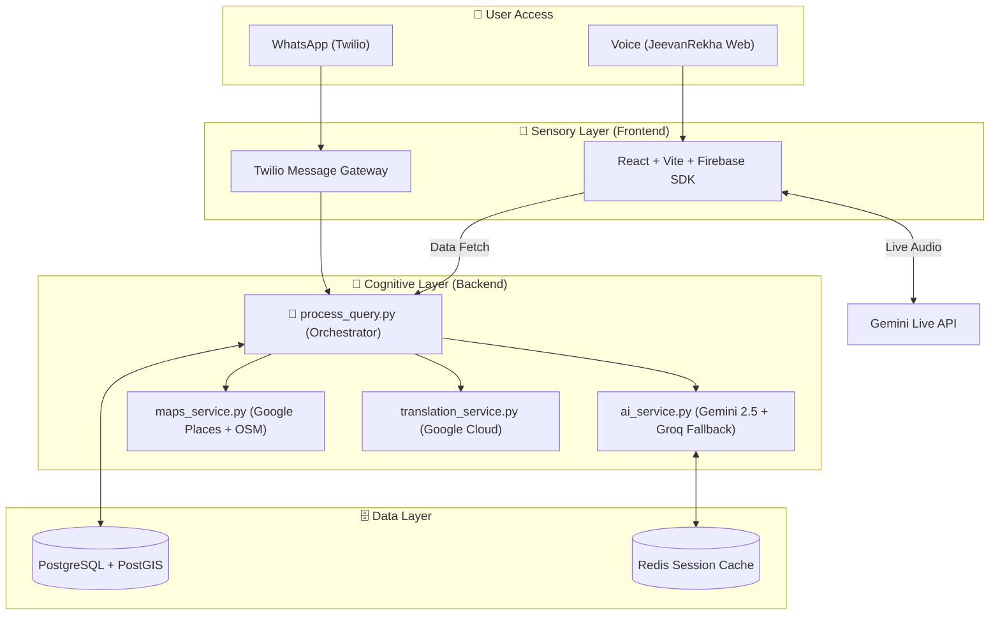
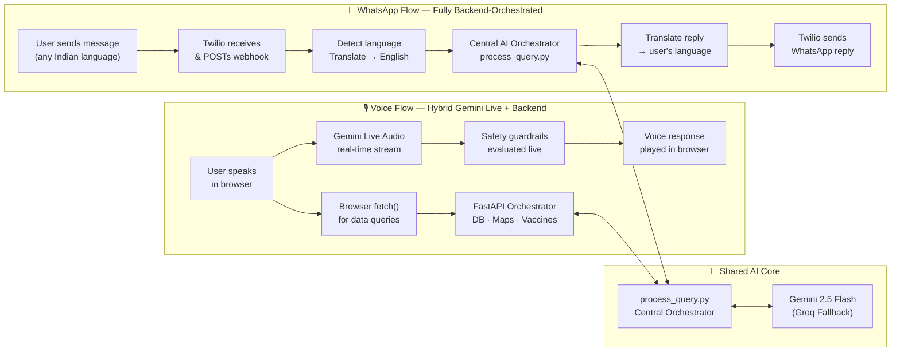
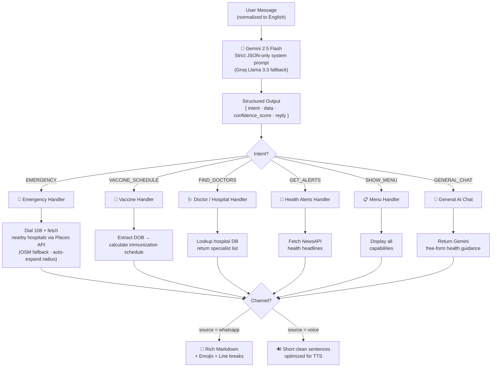
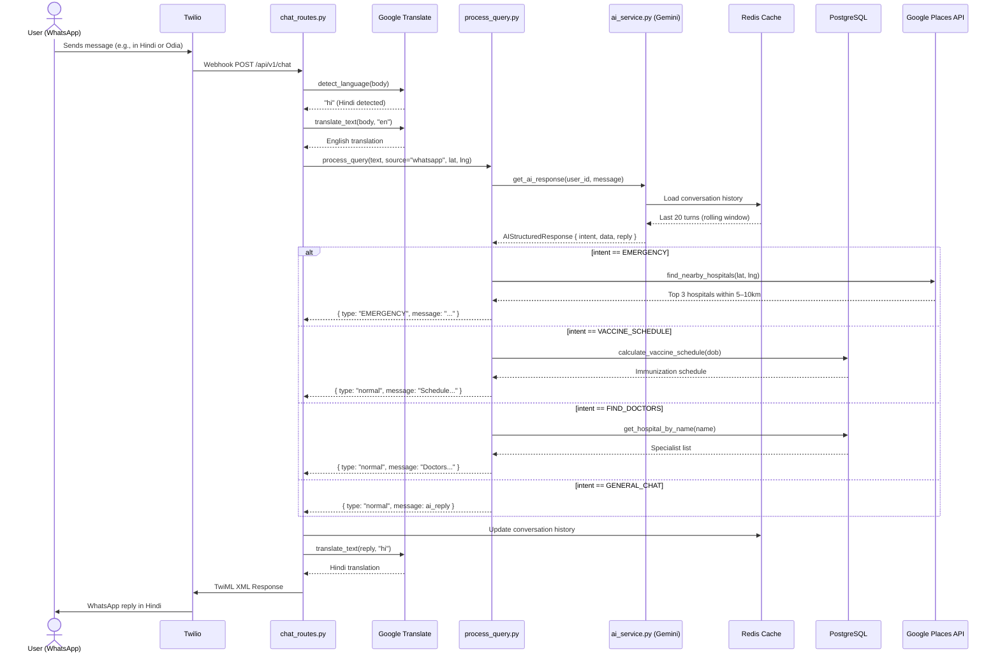
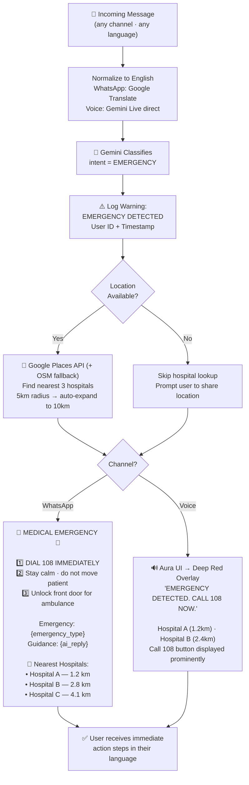
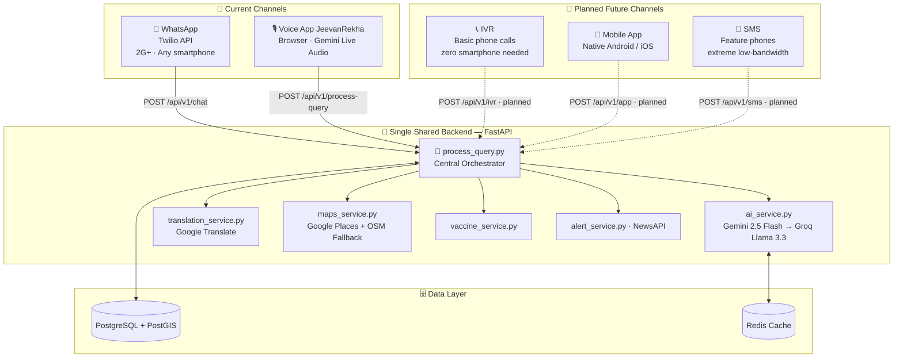

# JeevanRekha (जीवनरेखा)
### *Centralized Intelligence. Multi-Channel Accessibility. Zero Barriers.*

> **JeevanRekha** is an omnichannel public health platform delivering AI-powered medical guidance via **WhatsApp** and a **voice assistant** — built for the Indian landscape, ensuring accessibility regardless of language, literacy, or device bandwidth.

---

## ⚡ 30-Second Overview

JeevanRekha is an AI-powered healthcare assistant accessible via **WhatsApp (text)** and a **voice-first web app**.

- Works in **8+ Indian languages**
- Provides **real-time health guidance**
- Detects **medical emergencies instantly**
- Helps users find **nearby hospitals**
- Runs on both **2G phones and modern browsers**

One AI brain. Multiple access points. Built for India.

---

## 🚀 Live Demo

| Channel | Link | Status |
|---|---|---|
| 🎙️ Voice App (JeevanRekha) | [jeevanrekha-voice.vercel.app](https://jeevanrekha-voice.vercel.app) | ✅ Live |
| 💬 WhatsApp Bot | [Chat on WhatsApp](https://wa.me/14155238886?text=join+carefully-throat) | ✅ Live |
| 🌐 Landing Page | [jeevanrekha.vercel.app](https://jeevanrekha.vercel.app) | ✅ Live |

**Try these prompts right now:**

```
💬 "Mujhe kal se bukhaar hai"              — (Hindi) Fever since yesterday
💬 "Where is the nearest hospital?"        — Hospital discovery
💬 "My father has chest pain"              — Triggers emergency protocol
💬 "What vaccines does my 3-month-old baby need?"  — Vaccine scheduling
💬 "I have a headache and vomiting since morning"  — Symptom triage
```

> 🗣️ On JeevanRekha — just open the link, allow microphone, and **speak** in your language. The app detects your state and responds in your regional language automatically.

---

## 📑 Table of Contents

1. [Key Features](#-key-features)
2. [The Problem](#the-problem)
3. [The Solution](#the-solution)
4. [User Experience Flow](#-user-experience-flow)
5. [Why This Matters](#why-this-matters)
6. [Safety First](#️-safety-first--what-this-platform-will-never-do)
7. [System at a Glance](#system-at-a-glance)
8. [Feature Matrix](#feature-matrix)
9. [Example Scenarios](#-example-scenarios)
10. [Architecture & Diagrams](#architecture)
11. [The "Aura" Design Protocol](#-the-aura-design-protocol)
12. [Core Function Reference — Frontend](#-core-function-reference--frontend)
13. [Core Function Reference — Backend](#️-core-function-reference--backend)
14. [Scalability & Future Readiness](#-scalability--future-readiness)
15. [Tech Stack](#tech-stack)
16. [Setup & Deployment](#setup--deployment)
17. [API Reference](#api-reference)
18. [Roadmap](#roadmap)
19. [Authors](#authors)

---

## ✨ Key Features

- 🎙️ **Multilingual Voice Interaction** — Supports 8+ Indian regional languages including Telugu, Hindi, Tamil, Gujarati, Bengali, Odia, and Assamese. Language is auto-detected from GPS location.
- ⚡ **Real-Time AI Responses** — Sub-second voice responses powered by Gemini 2.5 Flash with automatic fallback to Groq Llama 3.3 for high availability.
- 📱 **WhatsApp on 2G** — Full functionality over basic text on 2G/3G networks. No app installation required.
- 🚨 **Emergency Detection & Escalation** — Automatically identifies life-threatening symptoms, surfaces nearby hospitals, and displays the 108 emergency number with a red-alert overlay.
- 🏥 **Live Hospital Discovery** — Uses Google Places API (primary) with OpenStreetMap as fallback. Auto-expands search radius from 5km → 10km if no results found nearby.
- 💉 **Vaccine Scheduling** — Provides age-appropriate immunization guidance based on national health guidelines.
- 🧠 **Contextual Session Memory** — Maintains a 20-turn conversation window per session, enabling multi-turn medical conversations without losing context.
- 🔒 **Built-in Medical Guardrails** — Hard-coded safety policies prevent prescription of medications or clinical diagnosis, keeping responses advisory only.
- 💬 **Conversational AI Responses** — Designed to be clear, human-like, and easy to understand. Not robotic checklists.
- 📱 **Mobile-First Voice UI** — Fully responsive voice app with dedicated mobile layout: bottom action bar, full-screen language selector, waveform visualizer, and Speaker/Mute/End call controls.

---

## 🚀 What Makes This Different

- Not just a chatbot — a **multi-channel health system**
- Works on **both low-end (2G) and high-end (voice AI) devices**
- Uses a **central AI orchestrator** for consistent responses across all channels
- Designed specifically for **India's healthcare access gap** — not a generic global tool
- Built with **safety-first AI guardrails** — no diagnosis, no prescriptions, emergency-always-first


---

## The Problem

India has **one doctor for every 1,511 people** — less than half the WHO recommendation. Over **700 million citizens** in rural and semi-urban areas lack reliable access to basic healthcare information. Language barriers, low digital literacy, and poor infrastructure create a wall that most people simply cannot cross when they need medical help.

A parent in Koraput doesn't know if their child's fever is serious. A farmer in Nandyal can't read the health advisory posted at the clinic. An elderly woman in Vizag has no one to call at 2am.

**Phone calls go unanswered. Clinics are far. The internet is overwhelming.**

---

## The Solution

**JeevanRekha** meets people where they already are — on WhatsApp or in a browser — and speaks their language.

- **WhatsApp Channel** — Low-bandwidth, text-based access for any phone on 2G+. Powered by a fully backend-driven AI orchestration pipeline that handles translation, intent routing, and response formatting end-to-end.
- **Voice Channel (JeevanRekha)** — High-bandwidth, voice-first browser app for users who can't or won't type. A hybrid model: Gemini Live Audio handles real-time spoken conversations; the FastAPI backend supplies structured data (hospitals, vaccines, alerts) via JSON API.

**Both channels share the same AI brain** — same intent logic, same safety guardrails, same response quality. Only the format changes.

---

## ⚡ User Experience Flow

```
1. User opens WhatsApp or the JeevanRekha browser app
        ↓
2. Language auto-detected (WhatsApp: Google Translate · Voice: GPS → state → language)
        ↓
3. User types or speaks their health query — in any Indian language
        ↓
4. AI classifies intent → routes to the right service → responds in user's language
        ↓
5. If emergency detected → 108 escalation + nearest hospitals surfaced immediately
```

No registration. No app download for WhatsApp. No English required.

---

## Why This Matters

India's healthcare gap is not just about hospitals — it's about **information reaching people before it's too late**. This platform addresses three compounding barriers:

| Impact Area | Detail |
|---|---|
| 🌍 **Reach** | Works on 2G networks and basic Android phones via WhatsApp — designed for rural India, not urban tech users |
| 🗣️ **Inclusion** | Supports 8+ Indian regional languages — a farmer in Odisha and a mother in Tamil Nadu can both use it fluently in their mother tongue |
| 🚨 **Safety** | Instant emergency detection triggers 108 escalation and nearest hospital lookup — no human agent needed |
| 💉 **Prevention** | Automated child vaccination scheduling directly reduces missed immunizations in communities without health workers |
| ⚡ **Speed** | Real-time triage and hospital finder, 24/7 — no waiting, no hold music, no English form to fill |

> If deployed at scale, this system can act as a **first line of healthcare access** for millions who currently have none.

---

## 🛡️ Safety First — What This Platform Will Never Do

This is an information and guidance system, not a diagnostic tool. These constraints are hard-coded into every system prompt and guardrail.

| Constraint | Detail |
|---|---|
| 🚫 **No Diagnosis** | AI provides guidance only — it will never tell a user they have a specific condition |
| 🚫 **No Prescriptions** | Medication recommendations are strictly prohibited at the prompt level |
| 🚨 **Emergency-First** | Any emergency keyword — in any language — triggers 108 escalation before any other response |
| 🛡️ **Dual Guardrails** | WhatsApp: backend system prompt rules · Voice: real-time `healthGuardrails.ts` evaluated on every audio turn |
| 👨‍⚕️ **Human-in-the-loop** | Users are always advised to consult a certified medical professional for formal clinical diagnosis |

---

## System at a Glance

| Metric | Value |
|---|---|
| Supported Channels | 2 (WhatsApp + Voice) |
| AI Intent Types | 6 |
| Hospital Search Radius | 5km (auto-expands to 10km if no results) |
| Session Memory | 20-turn rolling window (in-memory) |
| AI Fallback | Gemini 2.5 Flash → Groq Llama 3.3 |
| Min. Network Requirement | 2G (WhatsApp) / Broadband (Voice) |
| Languages Supported | 8+ Indian regional languages |
| Emergency Response | Always-first — never deferred |

---

## Feature Matrix

| Feature | WhatsApp | Voice (JeevanRekha) |
|---|:---:|:---:|
| 🚨 Emergency Detection & 108 Escalation | ✅ | ✅ |
| 🌍 Multi-lingual AI Support | ✅ | ✅ |
| 🏥 Real-time Hospital Finder (GPS) | ✅ | ✅ |
| 🔎 AI Symptom Triage | ✅ | ✅ |
| 💉 Automated Vaccination Scheduler | ✅ | ✅ |
| 📰 Real-time Health Alerts | ✅ | ✅ |
| 🎙️ Native Voice Interaction | ❌ | ✅ |
| 📍 Auto State & Language Detection | ❌ | ✅ |
| 💬 2G / Low-Bandwidth Support | ✅ | ❌ |
| 📱 Mobile-First UI | ❌ | ✅ |
| 🤖 AI Fallback (Groq) | ✅ | ✅ |

---

## 🧪 Example Scenarios

These are real conversations the system handles end-to-end, in any supported language.

---

**Scenario 1 — Symptom Triage**
> *User (WhatsApp, Hindi):* "Kal se bukhar hai aur sar mein dard ho raha hai"
> *(Translation: I've had fever since yesterday and my head hurts)*

→ AI asks clarifying questions (duration, temperature, other symptoms), advises home care, and flags when a doctor visit is warranted.

---

**Scenario 2 — Emergency**
> *User (Voice, Telugu):* "Nanna ki chest pain vastundi, chala serious ga undi"
> *(Translation: My father is having chest pain, it's very serious)*

→ Emergency detected instantly. Red-alert overlay activates. AI responds: *"EMERGENCY DETECTED. CALL 108 NOW."* — then surfaces the 3 nearest hospitals by distance.

---

**Scenario 3 — Hospital Finder**
> *User (WhatsApp):* "Where is the nearest government hospital?"

→ System uses GPS to query Google Places API (OSM fallback if needed), returns the top 3 nearby hospitals with names, distances, and directions.

---

**Scenario 4 — Vaccination Schedule**
> *User (WhatsApp, English):* "My baby is 3 months old. What vaccines are due?"

→ System returns the national immunization schedule for that age group, including vaccine names and recommended dates.

---

**Scenario 5 — Multilingual Query**
> *User (Voice, Telugu):* "నాకు రెండు రోజుల నుండి తలనొప్పిగా ఉంది."
> *(Translation: I've had a headache for two days)*

→ GPS detects Andhra Pradesh → Telugu selected automatically. AI responds entirely in Telugu with relevant guidance.

---

## Architecture

### Design Principle: Multi-Channel, Single Brain

The system is built on one core rule — **channels are separate, intelligence is shared**:

- The **WhatsApp channel** handles the full AI lifecycle in the backend: language detection → translation → Gemini intent classification → service routing → response translation back to the user's language.
- The **Voice channel** uses a **hybrid model**: Gemini Live Audio handles real-time voice streaming in the browser; the FastAPI backend serves structured data (hospitals, vaccines, alerts) via a JSON API.
- A single `process_query.py` orchestrator is the shared logic layer — same guardrails, same intent routing, channel-appropriate formatting output.
- **Model-Agnostic Resilience** — Gemini 2.5 Flash (primary) with automated fallback to Groq Llama 3.3 ensures high availability.

---

## 🧠 How to Read This Section

The following diagrams show different perspectives of the same system. You don't need to read all of them — each explains one specific part:

| Diagram | What it shows |
|---|---|
| **Diagram 1** | System architecture — every component and how they connect |
| **Diagram 2** | Data flow — how a message moves from user to AI to response |
| **Diagram 3** | AI decision logic — how Gemini classifies and routes each intent |
| **Diagram 4** | WhatsApp sequence — step-by-step execution of a real conversation |
| **Diagram 5** | Emergency flow — exactly what happens when a crisis is detected |
| **Diagram 6** | Scalability — why adding new channels requires zero backend changes |

You can skim these — each diagram explains one part of the system independently.

---

### Diagram 1 — High-Level System Architecture
> *Shows every component in the system and how they connect — users, channels, backend services, AI, and data layer — in a single view.*



---

### Diagram 2 — Data Flow
> *Shows how a user message travels through each channel — from input to AI to response — and where the two channels share the same backend core.*



---

### Diagram 3 — AI Intent & Decision Flow
> *Shows how Gemini classifies every user message into one of 6 structured intents, routes it to the correct service, and formats the reply differently for WhatsApp vs. voice.*



---

### Diagram 4 — WhatsApp Sequence Diagram
> *Traces a single WhatsApp message from the moment a user sends it to the moment they receive a reply — every service call, translation step, and DB query shown in order.*



---

### Diagram 5 — Emergency Response Flow
> *Shows the exact path a message takes when an emergency is detected — from any language, any channel — through escalation, hospital lookup, and channel-specific response formatting.*



---

### Diagram 6 — Multi-Channel Architecture
> *Shows why adding a new channel (IVR, SMS, mobile app) requires zero changes to the AI or backend logic — the orchestrator absorbs any new input source through a single endpoint pattern.*



---

## 🎨 The "Aura" Design Protocol

The voice frontend follows a high-fidelity interaction model designed for low-friction healthcare access. The centerpiece orb reflects the AI's internal cognitive state through responsive visual feedback.

### 🎙️ Interaction State Machine

| State | CSS Class | Animation | Background |
|---|---|---|---|
| **Idle** | `orb-body` | Gentle Breath | Multi-color Radial Gradient |
| **Listening** | `listening` | Rapid Scale Pulse | Cyan-Blue Glow |
| **Thinking** | `thinking` | 360° Conic Rotation | Rotating Aura Spirit |
| **Speaking** | `speaking` | High-Freq Alternation | Warm Magenta/Orange |
| **Emergency** | `emergency` | Red Flash Override | Deep Red — non-interruptible |

### Mobile UI Screens

| Screen | Trigger | Description |
|---|---|---|
| **Home** | Default | Orb, Start Call button, Language/Location cards, example prompts |
| **Active Call** | `startCall()` | Full-screen with live timer, waveform, Speaker/End/Mute controls |
| **Language Selector** | Tap Language card | Full-screen modal with radio list and Save button |
| **Examples** | Tap hamburger / View all | Full-screen list of demo scenarios |
| **Emergency** | AI detects red flag | Red overlay with Call 108 + Find Hospital buttons |

---

## 💻 Core Function Reference — Frontend

### `App.tsx` — Application Logic

- **`startCall(promptText?: string)`** — Initializes Firebase Anonymous Auth, connects to Gemini Multimodal Live, establishes an audio-only WebRTC session, sends the system instruction and opening turn (or a specific demo prompt). Gracefully alerts the user if Firebase config is missing instead of silently failing.
- **`handleUseLocation()`** — Requests GPS coordinates via Browser API, uses `inferNearestState` to map coordinates to one of 30+ Indian State Profiles, triggers a system-wide language/region update.
- **`endCall()`** — Gracefully terminates the WebRTC controller and session, resets the call timer and AI status.

### `healthGuardrails.ts` — The Safety Brain

- **`buildSystemInstruction()`** — Dynamically constructs the 2,000+ word system prompt. Injects the user's current state, primary language, and GPS coordinates. Enforces the medical safety policy (no prescriptions, no diagnosis).

---

## ⚙️ Core Function Reference — Backend

### `process_query.py` — The Orchestrator

- **`process_query(input, source, lat, lng)`** — Central entry point for all channels. Routes the query through `ai_service` for intent classification. If intent is `EMERGENCY`, triggers `maps_service` immediately before returning any other response.

### `ai_service.py` — The Cognitive Router

- **`get_ai_response(user_id, message)`** — Manages the primary-fallback system: **Gemini 2.5 Flash** (primary) → **Groq Llama 3.3** (fallback). Maintains a 20-turn rolling in-memory conversation history per user. System prompt uses an empathetic, conversational personality — responds like a caring human doctor rather than a robotic triage checklist.

### `maps_service.py` — Hospital Discovery

- **`find_nearby_hospitals(lat, lng, radius)`** — Primary: Google Places API (New) — returns name, address, phone, rating, open status. Fallback: OpenStreetMap Overpass API (free, no key required). Auto-expands: if 5km radius returns no results, automatically retries with 10km.

---

## 📈 Scalability & Future Readiness

The system was designed to grow — not to be rebuilt.

- **Modular services** — Each capability (Maps, Vaccine, Alerts, AI) is an independent service. New features plug into the orchestrator without touching existing logic.
- **Model-agnostic AI layer** — `ai_service.py` abstracts the model call. Swapping Gemini for another model (or adjusting the Groq fallback) requires changing one file.
- **Channel-agnostic backend** — Adding IVR, SMS, or a native mobile app means writing a new route file and pointing it at the same `process_query.py` orchestrator. The AI, DB, and services are untouched.
- **Government API ready** — The hospital and vaccine data layer is designed to accept integration with NHA (National Health Authority), Ayushman Bharat digital records, and state health portals via additional data adapters.
- **PostGIS geospatial foundation** — Hospital proximity queries are built on PostGIS, which scales to national hospital datasets without architectural changes.

---

## Tech Stack

### Backend — Shared AI Core

| Layer | Technology |
|---|---|
| API Framework | FastAPI (Python 3) + Uvicorn (ASGI) |
| Database | PostgreSQL + PostGIS · SQLAlchemy ORM · Alembic |
| Caching | Redis (20-turn session window) |
| AI Engine (Primary) | Google Gemini 2.5 Flash |
| AI Engine (Fallback) | Groq Llama 3.3-70b |
| Translation | Google Cloud Translation API |
| Geolocation | Google Places API (New) + OpenStreetMap fallback |
| Messaging | Twilio WhatsApp API |
| Health News | NewsAPI |

### Voice Frontend — JeevanRekha

| Layer | Technology |
|---|---|
| Framework | React + Vite + TypeScript |
| Voice Streaming | Firebase AI SDK (Gemini Live Audio) |
| User State | Firebase Anonymous Auth + Firestore |
| Location | Browser GPS → Indian state inference (30+ state profiles) |

---

## Setup & Deployment

### ☁️ Cloud Deployment (Recommended)

JeevanRekha is designed for **zero-dependency cloud hosting**. No local server or `ngrok` required for production.

1. **Backend (Render / GCP)** — Use the provided `Dockerfile` and `render.yaml`. Connect your GitHub repo to Render.com.
2. **Frontend (Vercel)** — Deploy the `voice_frontend` folder. Set `VITE_BACKEND_URL` to your Render service address.
3. **Environment Sync** — Copy keys from `.env.example` into your cloud provider's dashboard.

### 💻 Local Development

**Backend (FastAPI)**
```bash
cd app
pip install -r requirements.txt
uvicorn app.main:app --reload --port 8000
```

**Frontend (React)**
```bash
cd voice_frontend
npm install
npm run dev
# Open http://localhost:5173
```

### 🔑 Environment Variables

**Backend — set in Render Dashboard:**

| Key | Purpose |
|---|---|
| `GEMINI_API_KEY` | Gemini 2.5 Flash (primary AI) |
| `GROQ_API_KEY` | Llama 3.3 fallback AI |
| `GOOGLE_MAPS_API_KEY` | Google Places API for hospital search |
| `TWILIO_ACCOUNT_SID` | Twilio WhatsApp messaging |
| `TWILIO_AUTH_TOKEN` | Twilio authentication |
| `TWILIO_WHATSAPP_NUMBER` | Format: `whatsapp:+14155238886` |
| `DATABASE_URL` | PostgreSQL connection string (auto-set by Render) |
| `NEWS_API_KEY` | Health alerts via NewsAPI |

**Frontend — set in Vercel Dashboard:**

| Key | Purpose |
|---|---|
| `VITE_FIREBASE_API_KEY` | Firebase project API key |
| `VITE_FIREBASE_AUTH_DOMAIN` | Firebase auth domain |
| `VITE_FIREBASE_PROJECT_ID` | Firebase project ID |
| `VITE_FIREBASE_APP_ID` | Firebase app ID |
| `VITE_BACKEND_URL` | Your Render backend URL |

> ⚠️ **Key naming matters:** The code reads `GOOGLE_MAPS_API_KEY` and `TWILIO_WHATSAPP_NUMBER` exactly — using `GOOGLE_API_KEY` or `TWILIO_PHONE_NUMBER` will silently fail.

---

## API Reference

| Method | Endpoint | Channel | Description |
|---|---|---|---|
| `GET` | `/` | Both | Health check |
| `POST` | `/api/v1/chat` | WhatsApp | Twilio webhook — `From`, `Body`, `Latitude`, `Longitude` → TwiML XML |
| `POST` | `/api/v1/process-query` | Voice | JSON API — `{input, lat, lng, user_id}` → `{type, message, hospitals}` |

---

## Roadmap

- [x] **Phase 1** — Real-time Voice (Gemini Live)
- [x] **Phase 2** — Aura Design System & Multilingual Support (8+ Languages)
- [x] **Phase 3** — Full Cloud Deployment — Backend on Render, Frontend on Vercel
- [x] **Phase 4** — Mobile-First UI Redesign — Native app-like experience on phones
- [x] **Phase 5** — Hospital Search via Google Places API with OSM fallback + auto-expanding radius
- [x] **Phase 6** — Empathetic AI Personality — Conversational, human-like medical responses
- [x] **Phase 7** — Environment Config Hardening — Key names synced across `render.yaml`, `.env.example`, and `config.py`
- [ ] **Phase 8** — WhatsApp Voice Note processing (STT integration)
- [ ] **Phase 9** — Official Ayushman Bharat API integration for live scheme eligibility checks
- [ ] **Phase 10** — Push notifications for health alerts and vaccination reminders

---

## Authors

| Name | Role |
|---|---|
| **Ritesh Panda** | Backend Engineer — FastAPI, PostgreSQL, AI Orchestration, Twilio |
| **Arpit Mangaraj** | Frontend Engineer — React, Firebase, Gemini Live Voice, UI/UX |

---

## License

MIT License — see `LICENSE` for details.
