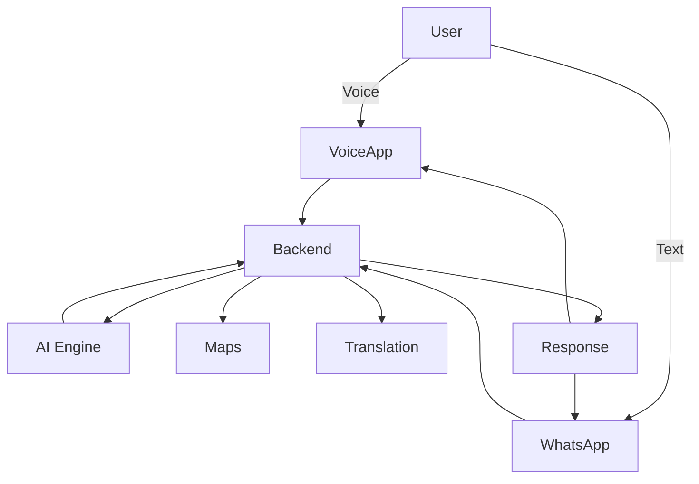
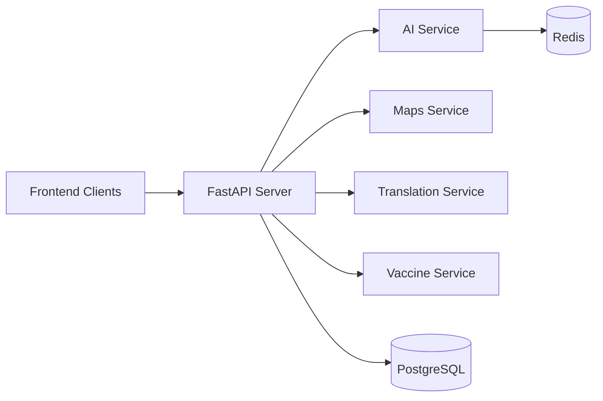
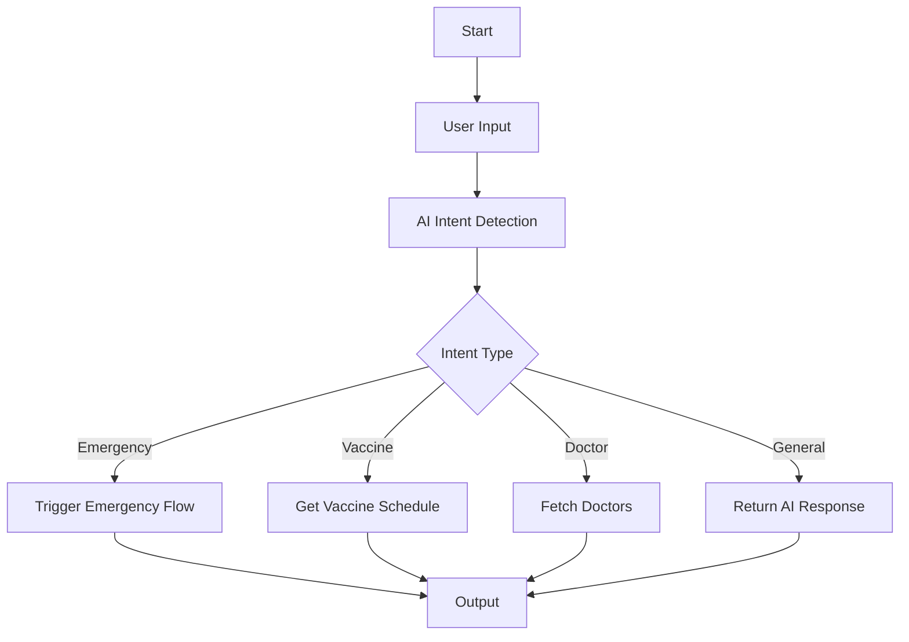
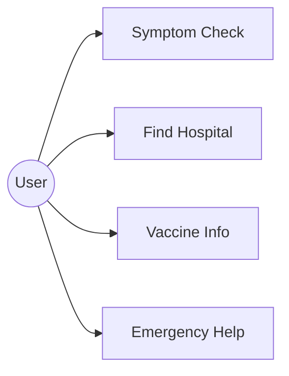
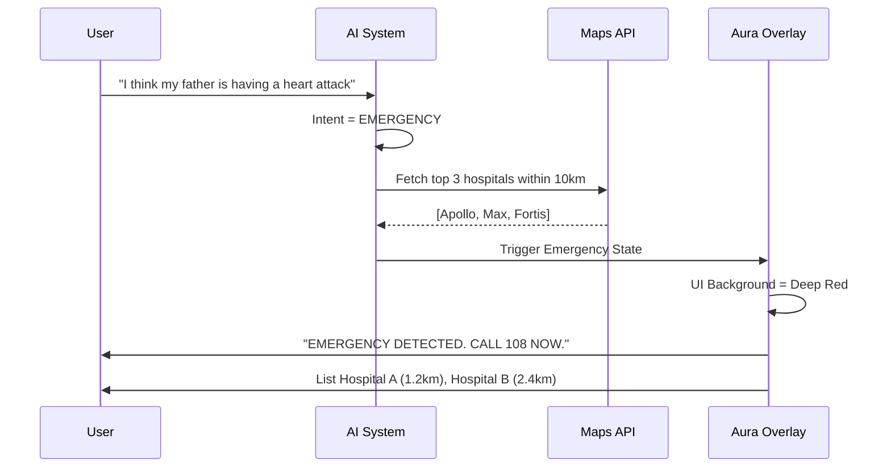

# 🏥 JeevanRekha (जीवनरेखा) — Intelligent Health Protocol
### *Centralized Intelligence. Multi-Channel Accessibility. Zero Barriers.*

> **JeevanRekha** is an omnichannel healthcare platform delivering AI-powered medical guidance via **WhatsApp** and a **high-performance voice assistant (JeevanRekha)**. Built for the Indian landscape, it ensures accessibility regardless of language, literacy, or device bandwidth.

---

## 🚀 Live Demo

| Channel | Link | Status |
|---|---|---|
| 🎙️ Voice App (JeevanRekha) | [jeevanrekha.app](https://your-voice-app-link.vercel.app) | ✅ Live |
| 💬 WhatsApp Bot | [Chat on WhatsApp](https://wa.me/91XXXXXXXXXX?text=Namaste) | ✅ Live |

### Try These Prompts
Paste or speak any of these to see the system in action:

- `"Mujhe kal se bukhaar hai"` — (Hindi) Fever since yesterday
- `"Where is the nearest hospital?"` — Hospital discovery
- `"My father has chest pain"` — Triggers emergency protocol
- `"What vaccines does my 3-month-old baby need?"` — Vaccine scheduling
- `"I have a headache and vomiting since morning"` — Symptom triage

> 💡 The system responds in your regional language automatically based on location.

---

## 📑 Table of Contents
1. [Key Features](#-key-features)
2. [System Architecture](#-system-architecture)
3. [The "Aura" Design Protocol](#-the-aura-design-protocol)
4. [User Experience Flow](#-user-experience-flow)
5. [Example Scenarios](#-example-scenarios)
6. [Core Function Reference (Frontend)](#-core-function-reference-frontend)
7. [Core Function Reference (Backend)](#-core-function-reference-backend)
8. [Intent & Decision Logic](#-intent--decision-logic)
9. [Emergency Escalation Protocol](#-emergency-escalation-protocol)
10. [Safety & Limitations](#-safety--limitations)
11. [Why This Matters](#-why-this-matters)
12. [Installation & Setup](#-installation--setup)
13. [Roadmap](#-roadmap)

---

## ✨ Key Features

- 🎙️ **Multilingual Voice Interaction** — Supports 8+ Indian regional languages including Telugu, Hindi, Tamil, Gujarati, and Bengali. Language is auto-detected from GPS location.
- ⚡ **Real-Time AI Responses** — Sub-second voice responses powered by Gemini 2.5 Flash with automatic fallback to Groq Llama 3.3 for high availability.
- 📱 **WhatsApp Support** — Full functionality over basic text on 2G/3G networks. No app installation required.
- 🚨 **Emergency Detection & Escalation** — Automatically identifies life-threatening symptoms and surfaces nearby hospitals with the 108 emergency number.
- 🏥 **Live Hospital Discovery** — Fetches real-time nearby hospitals within a configurable radius using Google Places API, with distance and directions.
- 💉 **Vaccine Scheduling** — Provides age-appropriate immunization guidance based on national health guidelines.
- 🧠 **Contextual Session Memory** — Maintains conversation history within a session (1-hour TTL via Redis), enabling multi-turn medical conversations.
- 🔒 **Built-in Medical Guardrails** — Hard-coded safety policies prevent prescription of medications or clinical diagnosis, keeping responses advisory only.

---

## 🏗️ System Architecture

### Multi-Channel, Single-Brain Philosophy
The system follows a **modular multi-channel architecture with a centralized AI backend**. Each input channel (Voice, WhatsApp) connects independently to a single orchestration layer, keeping the intelligence consistent and the channels interchangeable.


### 🧠 Architecture Philosophy
*   **Multi-Channel Strategy:** The backend is channel-agnostic, supporting both high-bandwidth Voice (WebRTC) and ultra-low-bandwidth Text (WhatsApp/2G) via a single unified orchestrator.
*   **Centralized Orchestration:** All intelligence is routed through `process_query.py`, ensuring consistent health guardrails and intent classification across all entry points.
*   **Model-Agnostic Resilience:** Utilizes a primary **Gemini 2.5 Flash** engine with an automated fallback to **Groq (Llama-3.3-70b)** to maintain high availability.
*   **Modular Service Layer:** Triage, Mapping, and Translation are decoupled into independent services, allowing for independent scaling and local integration.

> **Scalability Note:** This architecture supports horizontal scaling across regions, languages, and healthcare integrations — new languages, states, or API services (e.g., Ayushman Bharat) can be added without modifying the core orchestration layer.

---

## 📊 System Design & Flow Diagrams

### 1. High-Level System Architecture
The top-level view of how users interact with the healthcare protocol across different platforms.

(See Diagram in System Architecture Section Above)

### 2. Data Flow Diagram
Visualizing the journey of a user query from raw audio/text to actionable medical guidance.



### 3. Component Diagram
The internal structure of the FastAPI backend and its interaction with stateful data layers.



### 4. Activity Diagram
The decision-making logic used by the AI Orchestrator to route user intents.



### 5. Sequence Diagram
(See Emergency Escalation Protocol Section Below)

### 6. Use Case Diagram
Defining the core interactions available to the end-user.



---

## 🎨 The "Aura" Design Protocol
The frontend, **JeevanRekha**, follows a high-fidelity interaction model designed for low-friction healthcare access.

### 🎙️ Interaction State Machine
The centerpiece of the UI reflects the AI's internal cognitive state through responsive visual feedback:

| State | CSS Class | Animation | Background |
|---|---|---|---|
| **Idle** | `orb-body` | Gentle Breath | Multi-color Radial Gradient |
| **Listening** | `listening` | Rapid Scale Pulse | Cyan-Blue Glow |
| **Thinking** | `thinking` | 360° Conic Rotation | Rotating Aura Spirit |
| **Speaking** | `speaking` | High-Freq Alternation | Warm Magenta/Orange |

---

## 📱 User Experience Flow
A seamless, 4-step journey designed for accessibility:
1.  **Entry:** User opens the platform via Web or WhatsApp.
2.  **Recognition:** System automatically detects location (GPS) and maps the primary regional language (e.g., Gujarati, Telugu).
3.  **Interaction:** User speaks naturally. The AI processes symptoms and intent in real-time with sub-second latency.
4.  **Action:** AI provides clear guidance, locates nearby care, or triggers the Emergency Protocol if critical symptoms are detected.

---

## 💬 Example Scenarios

These scenarios demonstrate how the system handles real-world queries across different intents:

**Symptom Check**
> User: *"I have had a fever since yesterday and my body is aching."*
> JeevanRekha: Asks clarifying questions (duration, temperature, other symptoms), advises home care, and flags when a doctor visit is warranted.

**Hospital Discovery**
> User: *"Where is the nearest government hospital?"*
> JeevanRekha: Uses GPS to fetch the top 3 nearby hospitals, returns names, distances, and directions.

**Emergency Detection**
> User: *"My father suddenly has severe chest pain and cannot breathe."*
> JeevanRekha: Immediately activates Emergency Protocol — displays red alert UI, instructs user to call 108, and lists the 3 nearest hospitals.

**Vaccine Information**
> User: *"My baby is 3 months old. What vaccines are due?"*
> JeevanRekha: Returns the national immunization schedule for that age group, including vaccine names and recommended dates.

**Multilingual Query**
> User (in Telugu): *"నాకు రెండు రోజుల నుండి తలనొప్పిగా ఉంది."* (Headache for two days)
> JeevanRekha: Detects Telugu from GPS (Andhra Pradesh), responds entirely in Telugu with relevant guidance.

---

## 🛡️ Safety & Limitations
*   **Advisory Only:** JeevanRekha provides general health guidance and information. It is **not** a diagnostic tool.
*   **No Prescriptions:** The system is strictly prohibited from recommending specific medications or dosages.
*   **Emergency Priority:** Any signal of a life-threatening condition (Chest pain, severe trauma) triggers an immediate override, escalating to 108 emergency services and hospital locating.
*   **Human-in-the-loop:** Users are always advised to consult a certified medical professional for formal clinical diagnosis.

---

## 🌍 Why This Matters
India faces a massive **Healthcare Accessibility Gap**.
*   **Language Barrier:** Millions cannot access quality info because it's only available in English or Hindi.
*   **Literacy & Tech Gap:** Complex apps fail those with low digital literacy.
*   **The Voice Solution:** By combining **WhatsApp (Low Bandwidth)** and **Voice (Natural Interface)**, JeevanRekha ensures that even a person with basic phone access can get life-saving medical guidance in their mother tongue.

---

## 💻 Core Function Reference (Frontend)

### `App.tsx` — Application Logic
- **`startCall(promptText?: string)`**:
  - Initializes Firebase Anonymous Auth.
  - Connects to the **Gemini Multimodal Live** model.
  - Establishes an audio-only WebRTC session.
  - Sends the **System Instruction** and the **Opening Turn** (or a specific Demo prompt).
- **`handleUseLocation()`**:
  - Requests GPS coordinates via Browser API.
  - Uses `inferNearestState` to map coordinates to one of 30+ Indian State Profiles.
  - Triggers a system-wide Language/Region update.
- **`endCall()`**:
  - Gracefully terminates the WebRTC controller and session.
  - Resets the `callTimer` and `aiStatus`.

### `healthGuardrails.ts` — The "Safety Brain"
- **`buildSystemInstruction()`**:
  - Dynamically constructs the 2,000+ word system prompt.
  - Injects the user's **Current State**, **Primary Language**, and **GPS Coordinates**.
  - Enforces the **Medical Safety Policy** (No prescriptions, No diagnosis).

---

## ⚙️ Core Function Reference (Backend)

### `process_query.py` — The Orchestrator
- **`process_query(input, source, lat, lng)`**:
  - The central entry point for all channels.
  - Routes the query through the `ai_service` for intent classification.
  - Branching logic: If intent is `EMERGENCY`, triggers `maps_service` immediately.

### `ai_service.py` — The Cognitive Router
- **`get_ai_response(user_id, message)`**:
  - Manages the **Primary-Fallback System**.
  - **Gemini 2.5 Flash** (Primary) ➔ **Groq Llama 3.3** (Fallback).
  - Maintains session memory using **Upstash Redis** (1-hour TTL).

---

## 🚨 Emergency Escalation Protocol

When an emergency signal is detected (Chest pain, bleeding, etc.), the system initiates the **Crisis Sequence**:



> ⚠️ **Safety Priority:** The system overrides all conversational flows when an emergency intent is detected. Emergency response is non-interruptible and always surfaces the 108 helpline and hospital locations first, before any other guidance.

---

## 🛠️ Installation & Setup

### 🚀 Cloud Deployment (Recommended)
JeevanRekha is designed for **Zero-Dependency Cloud Hosting**. No local server or `ngrok` is required for production.

1.  **Backend (Render/GCP):** Use the provided `Dockerfile` and `render.yaml`. Connect your GitHub repo to Render.com.
2.  **Frontend (Vercel):** Deploy the `voice_frontend` folder. Set `VITE_BACKEND_URL` to your Render service address.
3.  **Environment Sync:** Copy the keys from `.env.example` into your cloud provider's dashboard.

### 💻 Local Development Protocol

**1. Backend (FastAPI)**
```bash
cd app
pip install -r requirements.txt
uvicorn app.main:app --reload --port 8000
```

**2. Frontend (React)**
```bash
cd voice_frontend
npm install
npm run dev
```

### 🔑 Environment Configuration
Ensure you have the following keys in your cloud dashboard or local `.env`:
- `FIREBASE_CONFIG`: For the Multimodal Live SDK.
- `GOOGLE_API_KEY`: For Gemini and Maps services.
- `UPSTASH_REDIS_URL`: For session state management.
- `GROQ_API_KEY`: For automated high-availability fallback.
- `VITE_BACKEND_URL`: Points the UI to your production API.

---

## 🛤️ Roadmap
- [x] **Phase 1:** Real-time Voice (Gemini Live).
- [x] **Phase 2:** Aura Design System & Multilingual Support (8+ Languages).
- [ ] **Phase 3:** WhatsApp Voice Note processing (STT integration).
- [ ] **Phase 4:** Official Ayushman Bharat API integration for live scheme checks.
